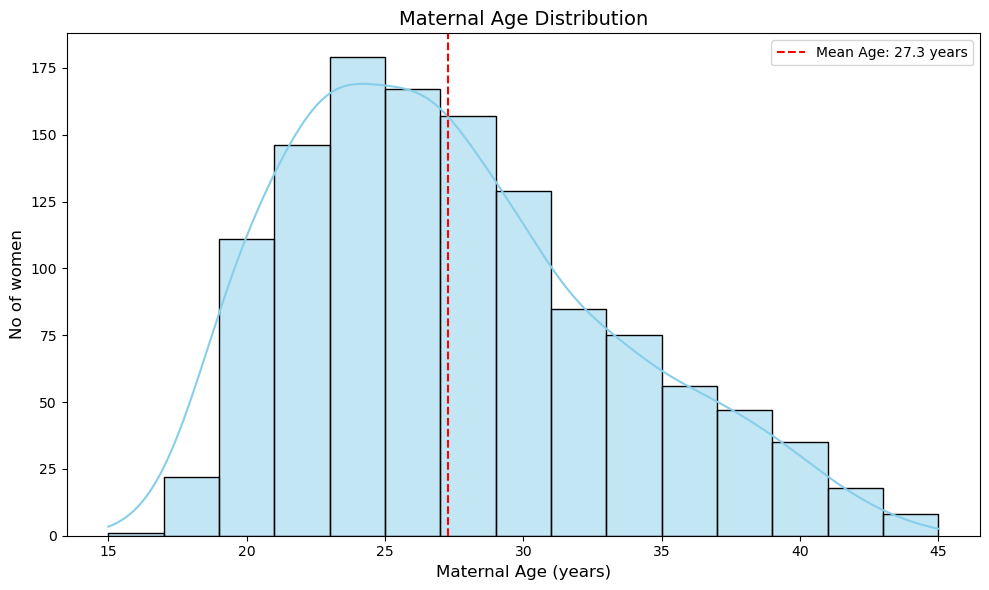

# Birth-weight-analysis

# Project Overview
This project analyzes critical factors affecting newborn birth weight, a key indicator of neonatal health. By examining maternal characteristics, prenatal care, and lifestyle habits, we provide data-driven insights to help healthcare providers and policymakers reduce low birth weight (LBW) incidence and improve infant health outcomes.

# Problem Statement
Low birth weight (<2500 grams) is associated with:

- Increased infant mortality risks

- Higher likelihood of chronic health conditions

- Developmental challenges

# Project Goals
- Analyze correlations between prenatal care, maternal health, and birth outcomes

- Identify key modifiable risk factors for low birth weight

- Provide evidence-based recommendations for reducing LBW incidence

## Data Understanding
Dataset: babies.csv (1,236 records)
Variables:

- case: Unique identifier

- bwt: Birth weight (grams) - target variable

- gestation: Pregnancy duration (days)

- parity: Pregnancy history (0 = first pregnancy)

- age: Maternal age (years)

- height: Maternal height (inches)

- weight: Maternal pre-pregnancy weight (pounds)

- smoke: Smoking status (0 = non-smoker, 1 = smoker)

## Data Cleaning:

## Filled missing values with column means:

- Gestation (13 missing)

- Maternal age (2 missing)

- Height (22 missing)

- Weight (36 missing)

- Smoking status (10 missing)

- Created derived categorical features:

- smoke: Categorized as "Smoker" or "Non-smoker"

- parity_group: "First pregnancy" vs "Previous pregnancies"

## Exploratory Data Analysis
# Maternal Age Distribution

Childbirth most common among women in their 20s

Mean maternal age: 27.3 years

Normal distribution with slight right skew

